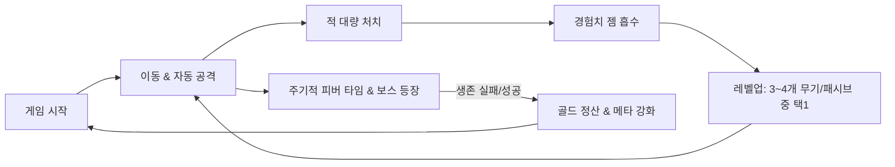

# [PRD] 뱀파이어 서바이벌 라이크 2D 게임 (가제: 프로젝트 뱀)

---

## 1. 개요 (Overview)
- **프로젝트명**: 프로젝트 뱀 (가제)
- **장르**: 2D 탑다운 오토배틀러 탄막 로그라이트 (Survivor-like)
- **개발 환경**: Godot Engine 4.x (GL Compatibility / 2D)
- **플랫폼**: PC (Windows / 웹 등 확장 고려)
- **핵심 목표**: 
  - **직관적이고 단순한 조작**: 플레이어는 오직 캐릭터 '이동'에만 집중.
  - **도파민 넘치는 성장 루프**: 대량의 적을 처치하고 보석을 흡수하며 무기를 증식·진화시키는 쾌감.
  - **빠른 호흡과 높은 재플레이성**: 1판당 10~15분 내외의 타임어택 서바이벌.

---

## 2. 핵심 게임플레이 루프 (Core Gameplay Loop)

---

## 3. 핵심 시스템 요구사항 (Core Features)

### 3.1 플레이어 (Player)
- **조작**: 8방향 이동 (키보드 WASD / 방향키). 공격은 완전 자동.
- **기본 스탯**:
  - `Max Health` (최대 체력)
  - `Move Speed` (이동 속도)
  - `Damage Multiplier` (공격력 배율)
  - `Attack Cooldown` (공격 주기 감소율)
  - `Pickup Range` (자석 범위: 젬 흡수 반경)
  - `Armor / Invulnerability Time` (방어력 / 피격 시 무적 시간)
- **상태 처리**: 피격 시 일시적 깜빡임(Invincible frame) 및 체력 소진 시 게임오버.

### 3.2 전투 및 무기 시스템 (Weapons & Passives)
- **자동 공격 방식**:
  1. **추적/투사체 무기 (마법 탄환)**: 가장 가까운 적을 조준하여 자동 유도 발사 (강화 시 투사체 수, 위력, 쿨다운 개선).
  2. **범위/오라 무기 (성스러운 마늘 오라)**: 플레이어 주변에 0.5초마다 지속 데미지를 입히는 원형 보호막 형성 (강화 시 반경 및 위력 증가).
  3. **회전 궤도 무기 (회오리 칼날)**: 플레이어 주변 궤도를 맹렬하게 고속 회전하며 적들을 연속 난도질하는 위성형 검기 칼날 (강화 시 칼날 수, 회전 반경, 속도, 위력 증가).
  4. **패시브 장신구**:
	 - `신속의 부츠`: 이동 속도 +15%
	 - `힘의 건틀릿`: 모든 무기 공격력 +20%
	 - `마력 자석`: 경험치 젬 흡수 반경 +35%
- **인벤토리 슬롯**:
  - 액티브 무기 최대 4~6개
  - 패시브 장신구 최대 4~6개 (스탯 증폭)
- **무기 진화 (Evolution)**:
  - 특정 무기 만렙(Lv.5~8) + 특정 패시브 보유 시 상자(Chest)를 통해 진화 무기 획득.

### 3.3 적 & 웨이브 스폰 시스템 (Enemies & Waves)
- **스폰 알고리즘**:
  - 플레이어 화면 밖 테두리(Off-screen, 반경 750~900px)에서 무작위 각도로 지속 생성.
  - 플레이어를 향해 단순 직진 추적(Simple Chase AI).
- **피버 타임 (Fever Time / 몬스터 폭주 이벤트)**:
  - **주기 및 지속**: 매 45초마다 12초간 발동.
  - **폭주 효과**:
	- 스폰 쿨다운 23% 단축 (초당 스폰 빈도 약 30% 증가).
	- 스폰 시 30% 확률로 1마리 추가 즉시 동시 생성 (총 몬스터 출현량 30~50% 대폭 증가).
	- HUD 상단에 "🔥 FEVER TIME! 몬스터 30% 증가 🔥" 펄스 깜빡임 배너 노출 및 생존 타이머 붉은색 점등.
- **난이도 곡선 (타이머 기반)**:
  - `00:00 ~ 03:00`: 기본 그런트 몬스터 등장 + 45초 주기 피버 타임.
  - `03:00 ~ 07:00`: 빠른 몬스터(박쥐 떼) 및 피버 타임 난이도 상승.
  - `07:00 ~ 10:00`: 맷집 높은 중형 몬스터 및 엘리트 몬스터(상자 드롭).
  - `10:00`: 최종 보스 출현 (또는 생존 성공).

### 3.4 아이템 및 레벨업 시스템 (Drop & Progression)
- **드롭 아이템**:
  - 경험치 젬 (Gem): 적 사망 시 드롭 (자석 범위 내 진입 시 플레이어에게 가속 흡수).
  - 골드 코인 (Gold): 영구 강화 재화.
  - 고기 / 회복약: 체력 회복.
  - 전체 흡수 자석: 화면의 모든 젬을 즉시 끌어옴.
- **레벨업 팝업**:
  - 필요 경험치 달성 시 게임 일시정지(`get_tree().paused = true`).
  - 현재 획득 가능한 무기/패시브 중 무작위 3개 카드 표시.
  - 선택 시 즉시 적용 후 게임 재개.

### 3.5 메타 프로그레션 (영구 강화)
- 게임 종료 후 수집한 골드로 메인 화면에서 영구 스탯 구매 (공격력 +5%, 이동속도 +5%, 자석범위 +10% 등).

---

## 4. 기술 스택 및 최적화 고려사항 (Godot 4 특화)

1. **대량 엔티티 처리 (Draw Call & Physics Optimization)**:
   - 화면에 수백 마리의 적이 동시 등장하므로 무거운 물리 연산(RigidBody) 대신 가벼운 `CharacterBody2D` 또는 `Area2D` 추적 방식 채택.
   - 필요 시 `MultiMeshInstance2D` 또는 서버 API(`PhysicsServer2D`)를 고려한 가벼운 충돌 판정.
2. **무한 맵 (Infinite Background)**:
   - 플레이어 카메라 위치 기반으로 실시간 타일링되는 가벼운 무한 그리드 렌더러([grid_background.gd](file:///c:/Users/82104/Documents/뱀-/scenes/main/grid_background.gd)) 채택.
3. **손맛/피드백 (Juiciness)**:
   - 적 피격 시 흰색 플래시(Tween / Modulate).
   - 치명타 및 대미지 숫자 팝업(Floating Damage Text).
   - 강한 타격 시 미세한 카메라 흔들림(Camera Shake).

---

## 5. 단계별 개발 로드맵 (MVP Roadmap)

| 단계 | 목표 | 세부 구현 내용 |
| :--- | :--- | :--- |
| **Phase 1: 핵심 프로토타입** (완료) | 조작과 기본 전투 검증 | - 플레이어 8방향 이동 및 카메라 추적 - 기본 무기 1종(마법탄) 자동 발사 - 적 1종 스폰 및 플레이어 추적 - 피격 무적(I-frame) 및 체력/게임오버 시스템 |
| **Phase 2: 성장 루프 구축** (완료) | 성장 루프 및 빌드 다양화 | - 경험치 젬 드롭/가속 흡수 로직 - 경험치 바 및 레벨업 3지선다 팝업 UI - 신규 무기: 성스러운 마늘 오라, **회오리 칼날** - 패시브 3종: 부츠, 건틀릿, 자석 - **피버 타임(45초 주기 몬스터 30% 폭주)** 시스템 |
| **Phase 3: 웨이브 & 다양성** | 게임다운 완결성 확보 | - 타이머 및 시간대별 스폰 테이블 - 적 종류 3종 추가 (빠른 적, 맷집 적, 보스) - 상자 드롭 및 무기 진화 1종 |
| **Phase 4: 완성도 & 폴리싱** | 게임 오버/승리 및 메타 요소 | - 게임오버 / 클리어 화면 및 골드 정산 - 로비 메타 업그레이드 상점 - 사운드/이펙트 튜닝 |
